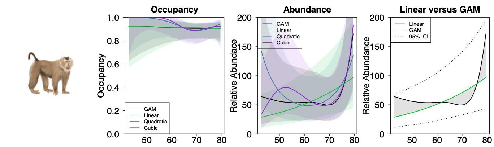

# OccuGAMs: Evaluating the performance of GAMs and polynomial approaches to nonlinear occupancy modelling when detection is imperfect

## Last updated: June 24th, 2025

Methods paper comparing OccuGAMs, AbuGAMs and conventional models for estimation of wildlife occupancy and abundance from cam-trap data.

---

## **Project Background**

This GitHub repository includes all code to implement the analyses featured in Sassen et al.'s OccuGAMs analysis, which comprises a comparison of polynomial and penalised spline (i.e. GAM) approaches to modelling non-linear responses to disturbance covariates. The repository also includes additional annotated code templates to implement 'OccuGAMs' in both STAN and JAGS.

The repository contains 2 types of scripts:
- **R scripts** consitute the majority of scripts. They are used to i) process data into formats suitable for modelling, ii) create simulated datasets, iii) Fit models to data - we fit 1000s of complex models utilising a High Performance Computing cluster [(HPC)](https://rcc.uq.edu.au/systems/high-performance-computing/bunya) and iv) Gather processed models from HPC cluster and visualise the results.
- **SLURM scripts** are used for batch processing of analyses on the HPC environment.

The camera trap data used in this analysis was prepared using a multi-step data cleaning pipeline that is backed up on GitHub but is currently private due to data-sharing agreements with our collaborators. The dataset provided in this repository has been de-identified, with all latitude and longitude coordinates removed to protect sampling locations.

To learn more about this camera trap data standardization pipeline, please contact Zachary Amir or Matthew Luskin to request access to the Asian Capture Histories GitHub Repository.

## **Repository Structure**

The repository is organised into 5 main folders, of which the folders **Analyses**, **Functions**, **Inputs** are the 3 folders strictly required to reproduce all analyses. The folder **Outputs** contains the majority of results including plots and model summaries.

# `Analyses/HPC_Packages` contains completed code and data packages that were sent/can be sent to a HPC environment. 
- `Analyses/HPC_Packages/05_HPC_Comprehensive` contains all code, data, and results for the case study portion of the paper. This comprises fitting linear, quadratic, cubic and GAM occupancy and n-mixture models for 4 species of tropical mammals (*Sus scrofa*, *Rusa unicolor*, *Macaca nemestrina*, genus *Muntiacus*).

